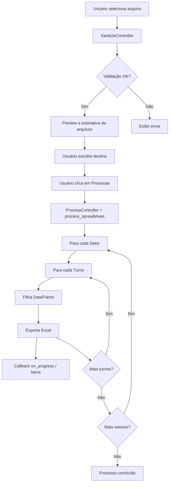

# Python Pandas Analyzer


Aplicação completa para análise e processamento de planilhas Excel com interface gráfica moderna. O sistema carrega, valida, sanitiza e exporta relatórios filtrados por setor e turno de forma automatizada.

## ✨ Funcionalidades

A aplicação oferece um fluxo completo de processamento de dados:

### 🔍 **Carregamento e Validação**

- Importação de arquivos Excel (`.xlsx` e `.xls`)
- Validação automática de estrutura mínima (colunas `SETOR` e `TURNO`)
- Sanitização completa do DataFrame:
  - Normalização de nomes de colunas
  - Remoção de espaços em branco
  - Validação de valores nulos
  - Detecção de dados inválidos

### 📊 **Visualização**

- Preview dos dados em tabela interativa com scroll horizontal e vertical
- Exibição clara de erros e avisos de validação
- Interface moderna e responsiva com CustomTkinter

### 📦 **Exportação Inteligente**

- Geração automática de relatórios separados por setor e turno
- Estimativa prévia do número de arquivos a serem gerados
- Barra de progresso em tempo real
- Nomenclatura padronizada: `Relatorio_{Setor}_{Turno}_{DD_MM_YYYY}.xlsx`
- Capacidade de cancelar o processamento a qualquer momento

## 🛠️ Arquitetura

O projeto segue uma arquitetura em camadas (modelo semelhante a MVP/MVC): **view** (GUI),
**application controller** (`AppController`), **threads de orquestração** e **serviços** puros.

```
src/
├── gui/                    # Interface gráfica (View)
│   ├── app.py             # Janela principal
│   ├── app_controller.py  # Controlador da aplicação
│   ├── components/        # Componentes reutilizáveis
│   │   ├── data_table.py  # Tabela de visualização
│   │   ├── sidebar.py     # Barra lateral
│   │   ├── header.py      # Cabeçalho com botões
│   │   ├── progressbar.py # Barra de progresso
│   │   └── baseboard.py   # Rodapé com ações
│   ├── dialogs/           # Diálogos e mensagens
│   └── theme/             # Temas e cores
├── controller/            # Lógica de controle
│   ├── sanitize_controller.py  # Validação em thread
│   └── process_controller.py   # Exportação em thread
├── services/              # Lógica de negócio
│   ├── sanitize_dataframe.py   # Sanitização de dados
│   ├── process_spreadsheet.py  # Processamento e export
│   └── estimate_export_jobs.py # Estimativa de jobs
├── models/                # Modelos de dados
│   ├── filtro.py          # Modelo de filtro
│   ├── export.py          # Modelo de exportação
│   └── processcontext.py  # Contexto de processamento
├── helpers/               # Utilitários
│   ├── helper.py          # Funções auxiliares
│   └── log.py             # Sistema de logging
└── constants.py           # Constantes do projeto
```

### Documentação no código

Os pacotes sob `src/` incluem **docstrings de módulo** (em especial nos `__init__.py` e nos serviços) para localizar responsabilidades rapidamente na IDE ou com `help(...)`.

### 🎯 **Principais Características da Arquitetura**

- **Separação de responsabilidades**: GUI, lógica de negócio e dados separados
- **Threading**: Operações pesadas executadas em threads separadas
- **Cancelamento gracioso**: Suporte para interrupção de processos
- **Callbacks de progresso**: Atualização em tempo real da interface
- **Logging estruturado**: Rastreamento completo de operações

## 📋 Requisitos da Planilha

Para que o processamento funcione corretamente, a planilha Excel deve conter **obrigatoriamente** as seguintes colunas:

| Coluna    | Descrição              | Exemplo                           |
| --------- | ------------------------ | --------------------------------- |
| `SETOR` | Identificação do setor | Produção, Qualidade, Logística |
| `TURNO` | Identificação do turno | Manhã, Tarde, Noite              |

> **Nota**: Todas as demais colunas presentes na planilha são preservadas e incluídas nos relatórios exportados.

## 🚀 Instalação

### Pré-requisitos

- Python **3.11 ou superior** (compatível com as versões fixadas em `requirements.txt`)
- pip (gerenciador de pacotes Python)

### Passos de Instalação

1. **Clone o repositório**:

```bash
git clone https://github.com/LuisMonteiro0211/python-pandas-analyzer.git
cd python-pandas-analyzer
```

2. **Crie um ambiente virtual** (recomendado):

```bash
python -m venv .venv
```

3. **Ative o ambiente virtual**:

- **Windows**:
  ```bash
  .venv\Scripts\activate
  ```
- **Linux/Mac**:
  ```bash
  source .venv/bin/activate
  ```

4. **Instale as dependências**:

```bash
pip install -r requirements.txt
```

## 💻 Como Usar

### Executando a Aplicação

```bash
python run_gui.py
```

### Fluxo de Uso

1. **Carregar Arquivo**

   - Clique em **Carregar Arquivo** (ou equivalente no cabeçalho)
   - Selecione uma planilha Excel (`.xlsx` ou `.xls`)
   - Aguarde a validação e sanitização automática
   - Visualize os dados na tabela de preview
2. **Escolher Destino**

   - Clique em **Exportar para** e escolha a pasta de destino
   - Selecione o diretório onde os relatórios serão salvos
3. **Processar**

   - Clique em **Processar** no rodapé
   - Acompanhe o progresso em tempo real
   - Use **Cancelar** se precisar interromper (exportações já gravadas permanecem na pasta)

### Mensagens e Feedback

| Ícone | Tipo    | Descrição                      |
| ------ | ------- | -------------------------------- |
| ✅     | Sucesso | Operação concluída com êxito |
| ⚠️   | Aviso   | Ação necessária do usuário   |
| ❌     | Erro    | Problema detectado com detalhes  |

## 🔄 Fluxo de Processamento



## 📂 Estrutura do Projeto

```text
python-pandas-analyzer/
├── 📄 README.md
├── 📄 requirements.txt
├── 📄 LICENSE
├── 📄 .gitignore
├── 🐍 run_gui.py                # Ponto de entrada da GUI
├── 📁 docs/                     # Documentação adicional (opcional)
├── 📁 exports/                  # Exemplo: saída dos relatórios (conforme pasta escolhida)
├── 📁 logs/                     # Se usar logging em arquivo
└── 📁 src/
    ├── 🐍 __init__.py
    ├── 🐍 constants.py          # Constantes globais
    ├── 📁 controller/           # Controladores
    │   ├── 🐍 __init__.py
    │   ├── 🐍 process_controller.py
    │   └── 🐍 sanitize_controller.py
    ├── 📁 gui/                  # Interface gráfica
    │   ├── 🐍 __init__.py
    │   ├── 🐍 app.py
    │   ├── 🐍 app_controller.py
    │   ├── 📁 components/
    │   │   ├── 🐍 __init__.py
    │   │   ├── 🐍 data_table.py
    │   │   ├── 🐍 sidebar.py
    │   │   ├── 🐍 header.py
    │   │   ├── 🐍 progressbar.py
    │   │   └── 🐍 baseboard.py
    │   ├── 📁 dialogs/
    │   │   ├── 🐍 __init__.py
    │   │   └── 🐍 dialogs.py
    │   └── 📁 theme/
    │       ├── 🐍 __init__.py
    │       └── 🐍 theme.py
    ├── 📁 helpers/              # Utilitários
    │   ├── 🐍 __init__.py
    │   ├── 🐍 helper.py
    │   └── 🐍 log.py
    ├── 📁 models/               # Modelos de dados
    │   ├── 🐍 __init__.py
    │   ├── 🐍 export.py
    │   ├── 🐍 filtro.py
    │   └── 🐍 processcontext.py
    └── 📁 services/             # Lógica de negócio
        ├── 🐍 __init__.py
        ├── 🐍 sanitize_dataframe.py
        ├── 🐍 process_spreadsheet.py
        └── 🐍 estimate_export_jobs.py
```

## 📤 Formato de Saída

Os relatórios gerados seguem o padrão de nomenclatura:

```
Relatorio_{Setor}_{Turno}_{DD_MM_YYYY}.xlsx
```

### Exemplo de Saída

Para uma planilha com 3 setores (Produção, Qualidade, Logística) e 2 turnos (Manhã, Tarde), serão gerados 6 arquivos:

```
📁 exports/
├── 📊 Relatorio_Producao_Manha_11_05_2026.xlsx
├── 📊 Relatorio_Producao_Tarde_11_05_2026.xlsx
├── 📊 Relatorio_Qualidade_Manha_11_05_2026.xlsx
├── 📊 Relatorio_Qualidade_Tarde_11_05_2026.xlsx
├── 📊 Relatorio_Logistica_Manha_11_05_2026.xlsx
└── 📊 Relatorio_Logistica_Tarde_11_05_2026.xlsx
```

Cada arquivo contém apenas os registros correspondentes ao seu setor e turno específicos.

## 🧪 Testes

### Executar Testes

```bash
pytest
```

### Executar com Cobertura

```bash
pytest --cov=src --cov-report=html
```

> **Nota**: Amplie a suíte conforme for adicionando módulos ou regras de negócio críticas.

## ⚠️ Problemas Comuns e Soluções

### ❌ "Arquivo não encontrado"

**Causa**: O caminho selecionado não existe ou não é um arquivo válido.
**Solução**: Verifique se o arquivo existe e se tem permissão de leitura.

### ❌ "Erro ao ler o arquivo"

**Causa**: Falha na leitura do Excel com pandas.**Solução**:

- Verifique se o arquivo está corrompido
- Certifique-se de que é um arquivo Excel válido (`.xlsx` ou `.xls`)
- Feche o arquivo caso esteja aberto em outro programa

### ❌ "Erro ao sanitizar o DataFrame"

**Causa**: A planilha não atende aos requisitos mínimos.**Solução**:

- Verifique se as colunas `SETOR` e `TURNO` existem
- Remova linhas completamente vazias
- Preencha valores obrigatórios

### ℹ️ Tabela de Preview

A pré-visualização pode não exibir todos os dados de uma vez. Use as barras de rolagem (horizontal e vertical) para navegar por todo o DataFrame.

### ⚠️ Cancelamento de Processo

Ao cancelar um processamento em andamento, os arquivos já exportados permanecerão no diretório de destino.

## 📦 Dependências

Principais bibliotecas utilizadas:

| Biblioteca              | Versão | Descrição                             |
| ----------------------- | ------- | --------------------------------------- |
| **pandas**        | 3.0.0   | Manipulação e análise de dados       |
| **openpyxl**      | 3.1.5   | Leitura/escrita de arquivos Excel       |
| **customtkinter** | 5.2.2   | Interface gráfica moderna              |
| **numpy**         | 2.4.1   | Operações numéricas                  |
| **pytest**        | 9.0.3   | Framework de testes                     |
| **python-dotenv** | 1.2.1   | Gerenciamento de variáveis de ambiente |

### Instalação de Dependências

Todas as dependências estão listadas em `requirements.txt` e podem ser instaladas com:

```bash
pip install -r requirements.txt
```

## 🤝 Contribuindo

Contribuições são muito bem-vindas! Para contribuir:

1. **Fork** o projeto
2. Crie uma **branch** para sua feature (`git checkout -b feature/MinhaFeature`)
3. **Commit** suas mudanças (`git commit -m 'Adiciona MinhaFeature'`)
4. **Push** para a branch (`git push origin feature/MinhaFeature`)
5. Abra um **Pull Request**

### Diretrizes

- Mantenha o código limpo e bem documentado
- Siga as convenções de código Python (PEP 8)
- Adicione testes para novas funcionalidades
- Atualize a documentação quando necessário

## 📝 Licença

Este projeto está sob a licença MIT. Veja o arquivo `LICENSE` para mais detalhes.

## 👨‍💻 Autor

**Luis Monteiro**

- GitHub: [@LuisMonteiro0211](https://github.com/LuisMonteiro0211)

<p align="center">
  Desenvolvido com ❤️ por <a href="https://github.com/LuisMonteiro0211">Luis Monteiro</a>
</p>
