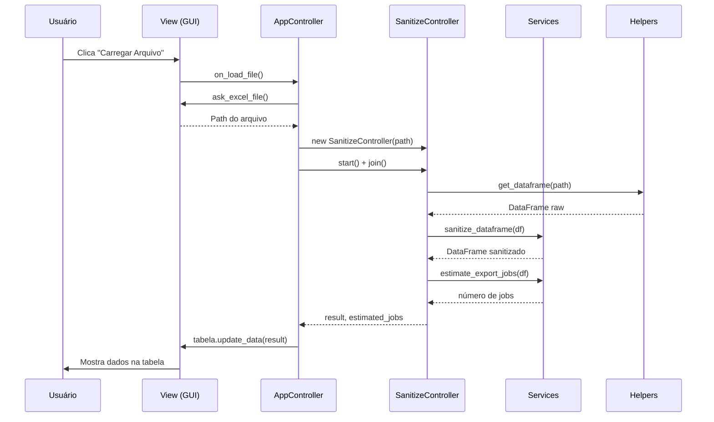
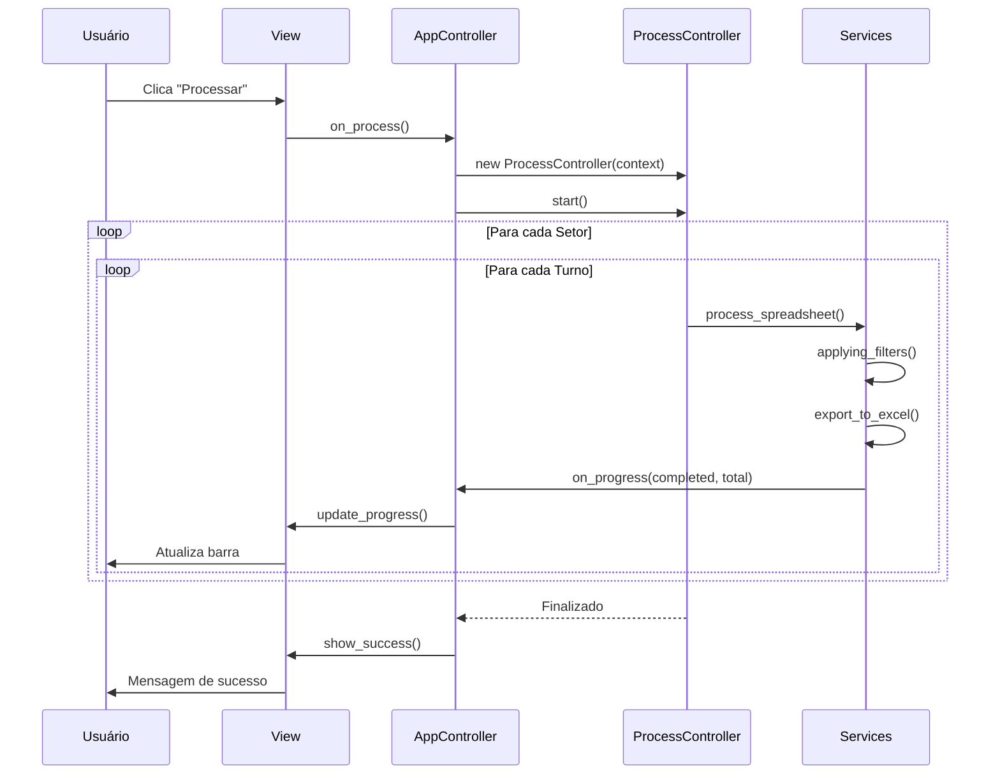

# Arquitetura do Projeto

> Documentação técnica detalhada sobre a estrutura, padrões e decisões de design do Python Pandas Analyzer.

## 📑 Índice

1. [Visão Geral](#visão-geral)
2. [Padrão de Arquitetura](#padrão-de-arquitetura)
3. [Estrutura de Diretórios](#estrutura-de-diretórios)
4. [Camadas da Aplicação](#camadas-da-aplicação)
5. [Fluxo de Dados](#fluxo-de-dados)
6. [Threading e Concorrência](#threading-e-concorrência)
7. [Padrões de Código](#padrões-de-código)

---

## 🎯 Visão Geral

O Python Pandas Analyzer é uma aplicação desktop construída com CustomTkinter que segue o padrão **MVC (Model-View-Controller)** com uma camada adicional de **Services** para lógica de negócio.

### Princípios de Design

1. **Separação de Responsabilidades**: Cada módulo tem uma única responsabilidade bem definida
2. **Baixo Acoplamento**: Módulos se comunicam através de interfaces claras
3. **Alta Coesão**: Funcionalidades relacionadas ficam juntas
4. **Threading Responsável**: Operações pesadas não bloqueiam a UI

---

## 🏗️ Padrão de Arquitetura

### MVC + Services

```
┌─────────────────────────────────────────────────┐
│                    VIEW (GUI)                    │
│  ┌──────────────────────────────────────────┐   │
│  │  App (Janela Principal)                  │   │
│  │  ├── Components (DataTable, Header...)   │   │
│  │  ├── Dialogs (Mensagens, Seleção)       │   │
│  │  └── Theme (Cores, Fontes)              │   │
│  └──────────────────────────────────────────┘   │
└─────────────────┬───────────────────────────────┘
                  │
                  ↓ eventos
┌─────────────────────────────────────────────────┐
│              CONTROLLER (Lógica UI)              │
│  ┌──────────────────────────────────────────┐   │
│  │  AppController                           │   │
│  │  ├── SanitizeController (Thread)        │   │
│  │  └── ProcessController (Thread)         │   │
│  └──────────────────────────────────────────┘   │
└─────────────────┬───────────────────────────────┘
                  │
                  ↓ chama
┌─────────────────────────────────────────────────┐
│            SERVICES (Lógica Negócio)             │
│  ┌──────────────────────────────────────────┐   │
│  │  sanitize_dataframe()                    │   │
│  │  process_spreadsheet()                   │   │
│  │  estimate_export_jobs()                  │   │
│  └──────────────────────────────────────────┘   │
└─────────────────┬───────────────────────────────┘
                  │
                  ↓ usa
┌─────────────────────────────────────────────────┐
│               MODELS (Dados)                     │
│  ┌──────────────────────────────────────────┐   │
│  │  Filtro, Export, ProcessContext          │   │
│  └──────────────────────────────────────────┘   │
└─────────────────────────────────────────────────┘
                  │
                  ↓ usa
┌─────────────────────────────────────────────────┐
│             HELPERS (Utilitários)                │
│  ┌──────────────────────────────────────────┐   │
│  │  helper.py (funções auxiliares)         │   │
│  │  log.py (configuração de logging)       │   │
│  └──────────────────────────────────────────┘   │
└─────────────────────────────────────────────────┘
```

---

## 📂 Estrutura de Diretórios

```
src/
├── constants.py              # Constantes globais (REQUIRED_COLUMNS)
│
├── gui/                      # Interface Gráfica (VIEW)
│   ├── app.py               # Janela principal
│   ├── app_controller.py    # Controlador da aplicação
│   ├── components/          # Componentes reutilizáveis
│   │   ├── data_table.py   # Tabela de dados
│   │   ├── header.py       # Cabeçalho com botões
│   │   ├── sidebar.py      # Barra lateral
│   │   ├── progressbar.py  # Barra de progresso
│   │   └── baseboard.py    # Rodapé com ações
│   ├── dialogs/            # Diálogos e mensagens
│   │   └── dialogs.py     # Funções de diálogo
│   └── theme/             # Temas e estilos
│       └── theme.py       # Cores, fontes, config
│
├── controller/              # Controladores (CONTROLLER)
│   ├── sanitize_controller.py  # Thread de sanitização
│   └── process_controller.py   # Thread de processamento
│
├── services/                # Lógica de Negócio (SERVICES)
│   ├── sanitize_dataframe.py  # Validação e limpeza
│   ├── process_spreadsheet.py # Processamento e export
│   └── estimate_export_jobs.py # Estimativa de jobs
│
├── models/                  # Modelos de Dados (MODEL)
│   ├── filtro.py           # Modelo de filtro
│   ├── export.py           # Modelo de exportação
│   └── processcontext.py   # Contexto de processamento
│
└── helpers/                 # Utilitários (HELPERS)
    ├── helper.py           # Funções auxiliares
    └── log.py              # Sistema de logging
```

---

## 🔄 Camadas da Aplicação

### 1. GUI (View)

**Responsabilidade**: Interface visual e interação com o usuário.

**Módulos**:
- `App`: Janela principal que monta todos os componentes
- `Components`: Widgets reutilizáveis (DataTable, Header, etc.)
- `Dialogs`: Mensagens e diálogos do sistema
- `Theme`: Centralização de cores, fontes e configurações visuais

**Regras**:
- ❌ Nunca contém lógica de negócio
- ❌ Não acessa diretamente services ou models
- ✅ Apenas monta UI e delega eventos ao controller

### 2. Controller

**Responsabilidade**: Orquestrar comunicação entre View e Services.

**Módulos**:
- `AppController`: Gerencia estado da aplicação e coordena fluxos
- `SanitizeController`: Thread para sanitização assíncrona
- `ProcessController`: Thread para processamento assíncrono

**Regras**:
- ✅ Recebe eventos da View
- ✅ Chama Services para lógica de negócio
- ✅ Atualiza View com resultados
- ✅ Gerencia threads para operações pesadas

### 3. Services

**Responsabilidade**: Lógica de negócio da aplicação.

**Módulos**:
- `sanitize_dataframe`: Validação e limpeza de dados
- `process_spreadsheet`: Filtragem e exportação de relatórios
- `estimate_export_jobs`: Cálculo de quantidade de jobs

**Regras**:
- ✅ Funções puras (sem side effects quando possível)
- ✅ Recebe dados via parâmetros
- ✅ Retorna resultados ou levanta exceções
- ❌ Nunca acessa GUI diretamente

### 4. Models

**Responsabilidade**: Estruturas de dados da aplicação.

**Módulos**:
- `Filtro`: Representa um filtro de DataFrame
- `Export`: Dados para exportação
- `ProcessContext`: Contexto de processamento com estado

**Regras**:
- ✅ Usa `@dataclass` para simplicidade
- ✅ Tipagem clara de todos os campos
- ✅ Imutável quando possível (`frozen=True`)

### 5. Helpers

**Responsabilidade**: Funções utilitárias reutilizáveis.

**Módulos**:
- `helper.py`: Funções auxiliares (leitura, filtros, validação)
- `log.py`: Configuração de logging

**Regras**:
- ✅ Funções genéricas e reutilizáveis
- ✅ Sem dependências de GUI
- ✅ Bem testáveis

---

## 🔀 Fluxo de Dados

### Carregamento de Arquivo



### Processamento e Exportação



---

## ⚡ Threading e Concorrência

### Estratégia de Threading

1. **Main Thread (GUI)**: Toda interação com CustomTkinter/Tkinter
2. **Worker Threads**: Operações I/O e processamento pesado

### SanitizeController

```python
class SanitizeController(threading.Thread):
    """Thread para carregar e validar arquivo Excel"""
    
    def run(self):
        # 1. Carrega DataFrame (I/O)
        # 2. Sanitiza (CPU)
        # 3. Estima jobs (CPU)
        # Resultado fica em self.result
```

**Uso**:
```python
controller = SanitizeController(path)
controller.start()  # Inicia thread
controller.join()   # Aguarda conclusão

if controller.error:
    # Trata erro
else:
    # Usa controller.result
```

### ProcessController

```python
class ProcessController(threading.Thread):
    """Thread para processar e exportar relatórios"""
    
    def run(self):
        # 1. Itera setores e turnos
        # 2. Filtra dados (CPU)
        # 3. Exporta Excel (I/O)
        # 4. Atualiza progresso via callback
```

**Cancelamento**:
```python
context.cancel_event.set()  # Sinaliza cancelamento
# ProcessController verifica event a cada iteração
```

### Comunicação Thread-Safe

**Callbacks de Progresso**:
```python
def on_progress(completed: int, total: int):
    """Callback chamado na worker thread"""
    # Agenda atualização na main thread
    view.after(0, lambda: view.update_progress(completed, total))
```

**Estado Compartilhado**:
- `ProcessContext`: Compartilha estado entre threads
- `Event`: Para cancelamento gracioso
- `after()`: Para agendar updates na GUI thread

---

## 💻 Padrões de Código

### Nomenclatura

| Tipo | Convenção | Exemplo |
|------|-----------|---------|
| Módulo | `snake_case` | `sanitize_dataframe.py` |
| Classe | `PascalCase` | `DataTable`, `ProcessController` |
| Função | `snake_case` | `get_dataframe()`, `apply_filters()` |
| Variável | `snake_case` | `safe_dataframe`, `diretorio_export` |
| Constante | `UPPER_SNAKE_CASE` | `REQUIRED_COLUMNS` |
| Privado | `_prefixo` | `_configure_appearance()` |

### Docstrings

**Formato Google Style**:

```python
def process_spreadsheet(context: ProcessContext) -> None:
    """
    Processa planilha aplicando filtros por setor/turno.

    Args:
        context: Contexto com DataFrame, diretório e callbacks.

    Raises:
        ValueError: Se DataFrame estiver vazio.

    Example:
        >>> ctx = ProcessContext(df=dataframe, diretorio=Path("./out"))
        >>> process_spreadsheet(ctx)
    """
```

### Type Hints

**Sempre use type hints**:

```python
from pathlib import Path
from typing import List, Optional

def get_unique_values(
    dataframe: pd.DataFrame,
    coluna: str
) -> List[str]:
    """Retorna valores únicos de uma coluna."""
    return dataframe[coluna].unique().tolist()
```

### Dataclasses

**Para modelos simples**:

```python
from dataclasses import dataclass
import pandas as pd

@dataclass
class Filtro:
    """Representa um filtro de DataFrame."""
    coluna: str
    dataframe: pd.DataFrame
    valor: str
```

### Tratamento de Erros

**Seja específico nas exceções**:

```python
# ❌ Ruim
try:
    df = pd.read_excel(path)
except:
    print("Erro!")

# ✅ Bom
try:
    df = pd.read_excel(path)
except FileNotFoundError as e:
    raise FileNotFoundError(f"Arquivo {path} não encontrado") from e
except Exception as e:
    raise ValueError(f"Erro ao ler {path}: {e}") from e
```

### Imports

**Organize por tipo**:

```python
# 1. Standard library
import os
from pathlib import Path
from typing import List

# 2. Third-party
import pandas as pd
import customtkinter as ctk

# 3. Local
from src.models import Filtro, Export
from src.helpers import get_dataframe
```

---

## 🎨 Tema e Estilo

### Centralização

Todas as cores, fontes e configurações visuais estão em `src/gui/theme/theme.py`:

```python
from src.gui.theme import COLORS, FONTS, SETTINGS

button = CTkButton(
    parent,
    fg_color=COLORS.button_background,
    hover_color=COLORS.button_hover,
    text_color=COLORS.button_text,
    font=CTkFont(
        family=FONTS.button_family,
        size=FONTS.button_size,
        weight=FONTS.button_weight
    )
)
```

**Benefícios**:
- Mudar tema = editar apenas theme.py
- Consistência visual garantida
- Fácil suporte a dark/light mode futuro

---

## 🔍 Validação e Sanitização

### Pipeline de Sanitização

```python
def sanitize_dataframe(df: pd.DataFrame) -> pd.DataFrame:
    """Pipeline de validação e limpeza."""
    dataframe_is_empty(df)                    # 1. Verifica vazio
    df.columns = safe_name_to_column(...)     # 2. Normaliza nomes
    check_colunas(df.columns, REQUIRED...)    # 3. Valida obrigatórias
    df = strip_space_in_column(...)           # 4. Remove espaços
    is_nan_in_column(REQUIRED_COLUMNS, df)    # 5. Valida NaN
    return df
```

**Cada etapa levanta exceção específica em caso de erro**.

---

## 📦 Exportação

### Estrutura de Exportação

```python
@dataclass
class Export:
    """Dados para exportação."""
    dataframe: pd.DataFrame
    diretorio: Path
    nome_arquivo: str

def export_to_excel(export: Export) -> None:
    """Exporta DataFrame para Excel."""
    caminho = export.diretorio / export.nome_arquivo
    export.dataframe.to_excel(caminho, index=False)
```

**Padrão de nomenclatura**:
```
Relatorio_{Setor}_{Turno}_{DD_MM_YYYY}.xlsx
```

---

## 🧪 Testabilidade

### Design para Testes

1. **Funções puras**: Facilitam testes unitários
2. **Injeção de dependência**: Controllers recebem contexto
3. **Separação de concerns**: Services isolados da GUI
4. **Type hints**: Detectam erros em tempo de desenvolvimento

### Exemplo Testável

```python
def applying_filters(filtro: Filtro) -> pd.DataFrame:
    """Aplica filtro - função pura, fácil de testar."""
    return filtro.dataframe[
        filtro.dataframe[filtro.coluna] == filtro.valor
    ]

# Teste
def test_applying_filters():
    df = pd.DataFrame({'A': [1, 2, 3], 'B': ['x', 'y', 'x']})
    filtro = Filtro(coluna='B', dataframe=df, valor='x')
    
    resultado = applying_filters(filtro)
    
    assert len(resultado) == 2
    assert resultado['A'].tolist() == [1, 3]
```

---

## 📚 Referências

- [CustomTkinter Documentation](https://customtkinter.tomschimansky.com/)
- [Pandas Documentation](https://pandas.pydata.org/docs/)
- [Python Type Hints (PEP 484)](https://www.python.org/dev/peps/pep-0484/)
- [Google Python Style Guide](https://google.github.io/styleguide/pyguide.html)
- [MVC Pattern](https://en.wikipedia.org/wiki/Model%E2%80%93view%E2%80%93controller)

---

**Última atualização**: 11/05/2026  
**Versão**: 1.0.0
